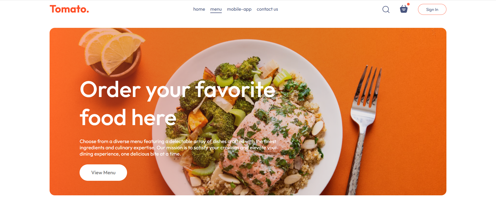
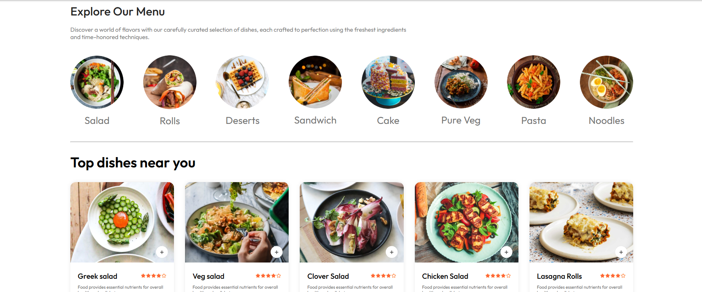

# TOMATO — Restaurant Website

TOMATO is a modern restaurant discovery and menu website built with React. The project focuses on creating a clean, engaging, and responsive frontend experience for users to explore dishes and discover restaurants.

>  **Status:** Frontend only — backend functionality is not implemented yet.

## ✨ Features

- 🍽️ Explore a curated selection of dishes
- 📍 Discover top dishes near you
- 🧭 Clean and intuitive navigation
- 📱 Responsive design for desktop and mobile
- 🎨 Modern restaurant-focused UI
- ⚡ Built with React for a dynamic frontend experience

## 🖥️ Preview


##


## 🛠️ Tech Stack

- React
- JavaScript
- HTML5
- CSS3

## 🚀 Getting Started

### Prerequisites

Make sure you have Node.js and npm installed on your machine.

### Installation

Clone the repository:

```bash
git clone https://github.com/athalawiksa/Tomato-restaurant.git

testes